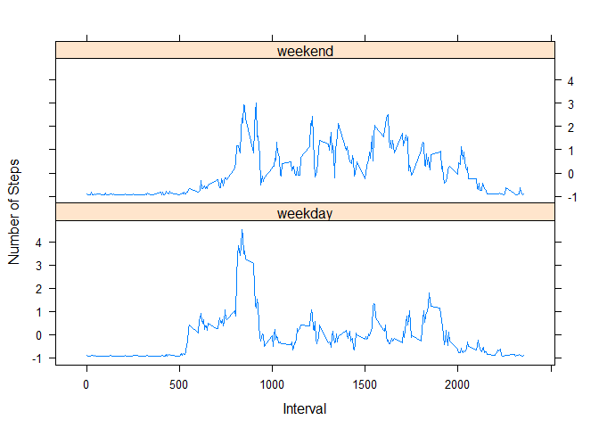

# Reproducible Research: Peer Assessment 1


## Loading and preprocessing the data


```r
  activityDat <- read.csv("./activity/activity.csv")
```


## What is mean total number of steps taken per day?
1. Calculate the total number of steps taken per day

```r
  library(sqldf)


  totSteps <- sqldf("select date, sum(steps) as tot_steps 
                    from activityDat group by 1 order by 1;")
  totSteps
```

```
##          date tot_steps
## 1  2012-10-01      <NA>
## 2  2012-10-02       126
## 3  2012-10-03     11352
## 4  2012-10-04     12116
## 5  2012-10-05     13294
## 6  2012-10-06     15420
## 7  2012-10-07     11015
## 8  2012-10-08      <NA>
## 9  2012-10-09     12811
## 10 2012-10-10      9900
## 11 2012-10-11     10304
## 12 2012-10-12     17382
## 13 2012-10-13     12426
## 14 2012-10-14     15098
## 15 2012-10-15     10139
## 16 2012-10-16     15084
## 17 2012-10-17     13452
## 18 2012-10-18     10056
## 19 2012-10-19     11829
## 20 2012-10-20     10395
## 21 2012-10-21      8821
## 22 2012-10-22     13460
## 23 2012-10-23      8918
## 24 2012-10-24      8355
## 25 2012-10-25      2492
## 26 2012-10-26      6778
## 27 2012-10-27     10119
## 28 2012-10-28     11458
## 29 2012-10-29      5018
## 30 2012-10-30      9819
## 31 2012-10-31     15414
## 32 2012-11-01      <NA>
## 33 2012-11-02     10600
## 34 2012-11-03     10571
## 35 2012-11-04      <NA>
## 36 2012-11-05     10439
## 37 2012-11-06      8334
## 38 2012-11-07     12883
## 39 2012-11-08      3219
## 40 2012-11-09      <NA>
## 41 2012-11-10      <NA>
## 42 2012-11-11     12608
## 43 2012-11-12     10765
## 44 2012-11-13      7336
## 45 2012-11-14      <NA>
## 46 2012-11-15        41
## 47 2012-11-16      5441
## 48 2012-11-17     14339
## 49 2012-11-18     15110
## 50 2012-11-19      8841
## 51 2012-11-20      4472
## 52 2012-11-21     12787
## 53 2012-11-22     20427
## 54 2012-11-23     21194
## 55 2012-11-24     14478
## 56 2012-11-25     11834
## 57 2012-11-26     11162
## 58 2012-11-27     13646
## 59 2012-11-28     10183
## 60 2012-11-29      7047
## 61 2012-11-30      <NA>
```


2. Histogram of the total number of steps taken each day

```r
  hist(as.numeric(totSteps$tot_steps), col="red", xlab="Steps", main="Total Steps Per Day")
```

 

3. The mean and median of the total number of steps taken per day are 10,766 and 10,765, respectively.

## What is the average daily activity pattern?
1. The average number of steps taken on 5-minute intervals, averaged across all days

```r
  intvalMeanXDays <- sqldf("select interval, avg(steps) as avg_steps from activityDat group by 1 order by 1;")
  plot(strptime(sprintf("%04d", intvalMeanXDays$interval), format="%H%M"), intvalMeanXDays$avg_steps, type="l", xlab="Time of Day",
  ylab = "Average Steps", main="Average Inverval Steps Across All Days", col="red")
```

 

2. The 5-minute interval, 835, on average contains the maximum number of steps across all days.

## Imputing missing values
1. It was found that 2,304 number of rows have missing values.
2. The activity dataset has many missing values, including for whole days. However, mean steps taken for each interval have already been calculated.  
Hence, the issue posed by missing values will be resolved by imputing average steps of the interval for all intervals with missing values.

```r
  imputedDf <- sqldf("select coalesce(t1.steps, t2.avg_steps) as steps, t1.date, t1.interval 
                     from activityDat as t1
                     left join intvalMeanXDays as t2
                     on t1.interval = t2.interval;")

  imputedTotSteps <- sqldf("select date, sum(steps) as tot_steps from imputedDf group by 1 order by 1;")
  imputedTotSteps
```

```
##          date tot_steps
## 1  2012-10-01     10641
## 2  2012-10-02       126
## 3  2012-10-03     11352
## 4  2012-10-04     12116
## 5  2012-10-05     13294
## 6  2012-10-06     15420
## 7  2012-10-07     11015
## 8  2012-10-08     10641
## 9  2012-10-09     12811
## 10 2012-10-10      9900
## 11 2012-10-11     10304
## 12 2012-10-12     17382
## 13 2012-10-13     12426
## 14 2012-10-14     15098
## 15 2012-10-15     10139
## 16 2012-10-16     15084
## 17 2012-10-17     13452
## 18 2012-10-18     10056
## 19 2012-10-19     11829
## 20 2012-10-20     10395
## 21 2012-10-21      8821
## 22 2012-10-22     13460
## 23 2012-10-23      8918
## 24 2012-10-24      8355
## 25 2012-10-25      2492
## 26 2012-10-26      6778
## 27 2012-10-27     10119
## 28 2012-10-28     11458
## 29 2012-10-29      5018
## 30 2012-10-30      9819
## 31 2012-10-31     15414
## 32 2012-11-01     10641
## 33 2012-11-02     10600
## 34 2012-11-03     10571
## 35 2012-11-04     10641
## 36 2012-11-05     10439
## 37 2012-11-06      8334
## 38 2012-11-07     12883
## 39 2012-11-08      3219
## 40 2012-11-09     10641
## 41 2012-11-10     10641
## 42 2012-11-11     12608
## 43 2012-11-12     10765
## 44 2012-11-13      7336
## 45 2012-11-14     10641
## 46 2012-11-15        41
## 47 2012-11-16      5441
## 48 2012-11-17     14339
## 49 2012-11-18     15110
## 50 2012-11-19      8841
## 51 2012-11-20      4472
## 52 2012-11-21     12787
## 53 2012-11-22     20427
## 54 2012-11-23     21194
## 55 2012-11-24     14478
## 56 2012-11-25     11834
## 57 2012-11-26     11162
## 58 2012-11-27     13646
## 59 2012-11-28     10183
## 60 2012-11-29      7047
## 61 2012-11-30     10641
```

```r
  hist(as.numeric(imputedTotSteps$tot_steps), col="red", xlab="Steps", main="Total Steps Per Day With Imputed Missing Values")
```

 

3. The mean and median values after imputing missing values are 10,750 and 10,641, respectively. Compared to the mean and median values calculated before imputing the missing values, these figures have decreased. The impact of the imputation on the daily total steps can be seen mainly in the interval (10,000 - 15,000), which increased from around 25 to 35. This is specially obvious when the first and second histograms are compared. 

## Are there differences in activity patterns between weekdays and weekends?


```r
  library(lattice)
  library(plyr)
  
  imputedDf$dayOfWeek <- weekdays(as.Date(imputedDf$date))
  oldVals <- c("Saturday","Sunday","Monday","Tuesday","Wednesday","Thursday","Friday")
  newVals <- factor(c("weekend","weekend","weekday","weekday","weekday","weekday","weekday"))
  imputedDf$dayType <- newVals[ match(imputedDf$dayOfWeek, oldVals) ] 

  imputedIntAvgDf <- ddply(imputedDf, .(dayType, interval), summarize, IntAvg = mean(as.numeric(steps)))
  imputedIntAvgDf <- transform(imputedIntAvgDf, IntAvg = scale(IntAvg))  
  
  lp <- xyplot(IntAvg ~ interval | dayType, data = imputedIntAvgDf, layout = c(1,2), type="l", 
  xlab="Interval", ylab="Number of Steps") 
  print(lp)
```

 

From the panel plot, it can be seen that activity patterns differ between weekdays and weekends. On weekdays, the step counts start to increase sharply just after interval 500 and peaks around interval 800. Then, the step counts fall sharply and hover around the mean until around interval 1800, when there is another significant peak before tapering off. These peaks probably represent the commutes to and from work.

On weekends, the steps also peak around interval 800. The difference is that, throughout the day, the step counts mostly remain above the mean, diping below the mean only after interval 2000. This probably shows that the person who recorded these steps remains physically active on weekends in contrast to more sedentary weekdays.  
